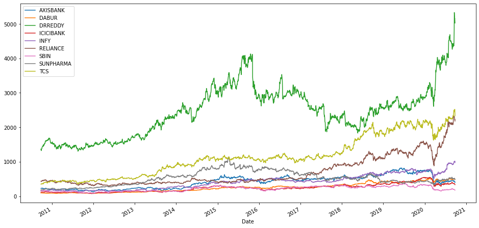
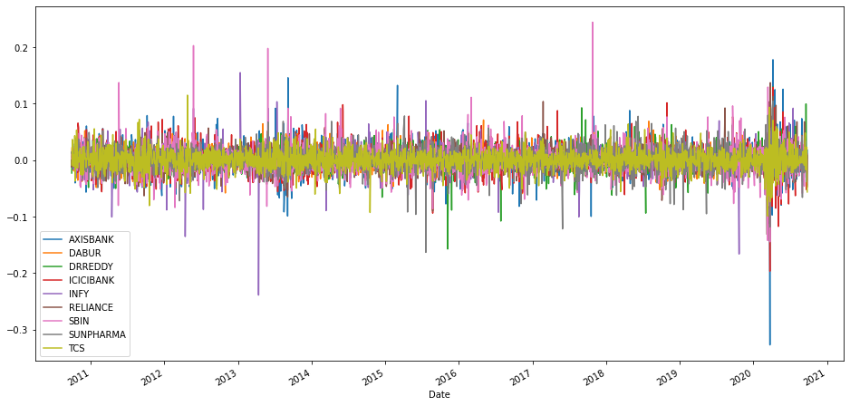
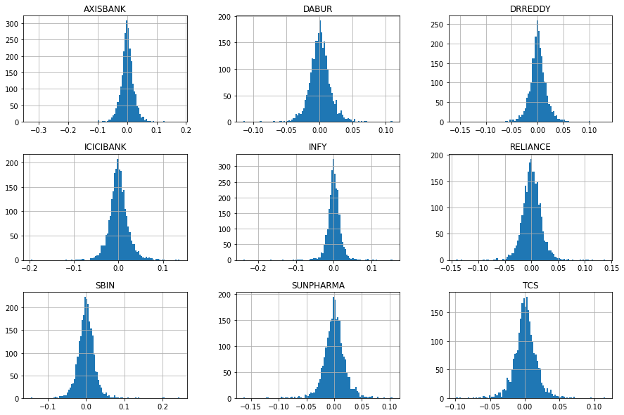
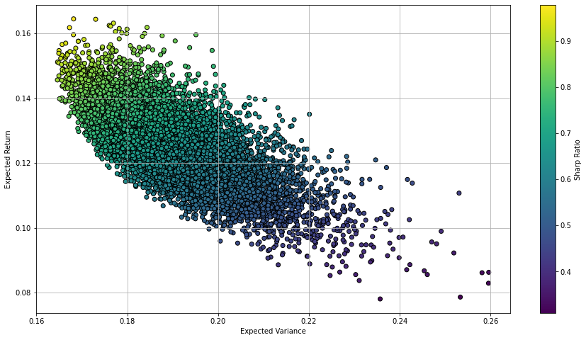
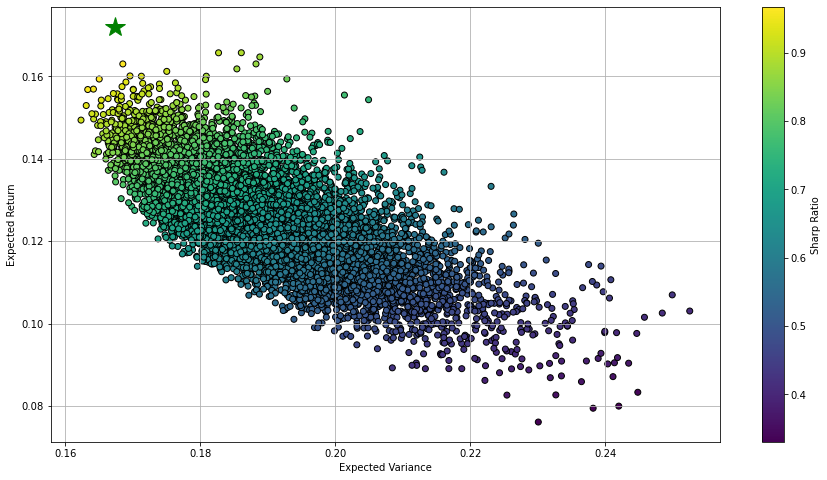

# Modern Portfolio Theory 

### Table of Contents
**[Question](#Question)**<br>
**[Background](#Background)**<br>
**[Source of data](#Source-of-data)**<br>
**[Analysing the data](#Analysing-the-data)**<br>
**[Simulation of portfolios](#Simulation-of-portfolios)**<br>
**[Optimization Method](#Optimization-Method)**<br>
**[Results](#Results)**<br>


## Question
One of the assumptions in financial modelling is that the returns of a security is a random variable. The standard deviation of the return is considered to be a measure of risk. The expected return should be higher for riskier securites and lower for safer securities. If we have several shares in a portfolio, is it possible to pick weights for the shares of the portfolio in such a way that the risk of the portfolio is smaller than risks of the individual shares? How to find the optimal portfolio which minimizes the risk while maximizing the returns of the portfolio? 

## Background
Let's consider a portfolio with $N$ securities.

* Portfolio value at time zero, ,  where 
 is the number of shares and $S_i(0)$ is the price of the security $i$.   
* Weights of the securities for the portfolio,   such that $\sum_{i=1}^N w_i=1$.  
* Return of the portfolio $R_p = \sum_{i=1}^N w_i R_i$, where $R_i$ is the return of security $i$.  
* Expected return of the portfolio $E(R_p)=\sum_{i=1}^N w_i E(R_i)$   
* Variance of the portfolio $Var(R_p)=E(R_p^2)-E(R_p)^2$  


The relationship between the log return (or continously compounded return) and the simple return is $r_t= log(1+R_t)$ or $R_t=e^{r_t}-1$. Log returns are more useful becuase of the additivity of risks, which is explained below.    
* For mutliperiod ($k$ periods) returns,  $r_t[k]=r_t + r_{t-1} + \ldots + r_{t-k+1}$.
* $Var(r_t[k]) = Var(r_t) + Var(r_{t-1}) + \ldots + Var(r_{t-k+1})$. This holds true only when $r_i$ are independent.  

Expected log return of the portfolio $E(r_p) \approx \sum_{i=1}^N w_i E(r_i)$, for a portfolio with $N$ securities.   
Variance of the log returns of the portfolio $Var(r_p)=E(r_p^2)-E(r_p)^2$, where $r_p = \sum_{i=1}^N w_i r_i$

## Source of data

In the following analysis, nine stocks (AXISBANK, DABUR, DRREDDY, ICICIBANK, INFY, RELIANCE, SBIN, SUNPHARMA and TCS) from NSE are considered. Historical data of these nine stocks are downloaded from [here](https://in.finance.yahoo.com). The data is stored in a folder named "data_2020_09_25".


```python
#Importing necessary libraries
import pandas as pd
import os
import numpy as np
import matplotlib.pyplot as plt
%matplotlib inline
```


```python
#Constants
# Starting and ending dates of historical data for our analysis
start_date = '2010-09-25'
end_date = '2020-09-25'
data_folder='data_2020_09_25' # this folder contains historical daily prices of stock of 10 companies
variable='Adj Close'
n_stocks=len(os.listdir(data_folder)) # number of securities
```

The following function reads the stock data from the folder 'data_2020_09_25' and returns a pandas dataframe


```python
def get_stocks_data_from_folder(data_folder, variable, start_date, end_date):
    files_list=os.listdir(data_folder)
    df=pd.DataFrame()
    for filename in files_list:
        file_path=os.path.join(data_folder,filename)
        col_name=filename.replace('.NS.csv','')
        df[col_name]=read_stock_variable_from_CSV(file_path,variable,start_date, end_date)[variable]

    return df

def read_stock_variable_from_CSV(file_path,variable,start_date, end_date):
    data=pd.read_csv(file_path)
    data['Date'] = data['Date'].apply(pd.to_datetime)
    data.set_index('Date',inplace=True)
    mask = (data.index >= start_date) & (data.index <= end_date)
    return data.loc[mask][['Adj Close']]
```

We now read the daily Adj close prices of compnaies from the folder 'data_2020_09_25' and save the data in a variable named 'data_adj_close'. Also, Nan values are removed.


```python
data_adj_close=get_stocks_data_from_folder(data_folder, 'Adj Close', start_date, end_date)
#missing_values_count = data_adj_close.isnull().sum()
#print(missing_values_count)
data_adj_close.dropna(inplace=True)
```

## Analysing the data


```python
data_adj_close
```


<div>
<style scoped>
    .dataframe tbody tr th:only-of-type {
        vertical-align: middle;
    }

    .dataframe tbody tr th {
        vertical-align: top;
    }

    .dataframe thead th {
        text-align: right;
    }
</style>
<table border="1" class="dataframe">
  <thead>
    <tr style="text-align: right;">
      <th></th>
      <th>AXISBANK</th>
      <th>DABUR</th>
      <th>DRREDDY</th>
      <th>ICICIBANK</th>
      <th>INFY</th>
      <th>RELIANCE</th>
      <th>SBIN</th>
      <th>SUNPHARMA</th>
      <th>TCS</th>
    </tr>
    <tr>
      <th>Date</th>
      <th></th>
      <th></th>
      <th></th>
      <th></th>
      <th></th>
      <th></th>
      <th></th>
      <th></th>
      <th></th>
    </tr>
  </thead>
  <tbody>
    <tr>
      <th>2010-09-27</th>
      <td>224.963867</td>
      <td>93.935127</td>
      <td>1370.616821</td>
      <td>117.560905</td>
      <td>160.808289</td>
      <td>435.443329</td>
      <td>152.465805</td>
      <td>182.664948</td>
      <td>351.578674</td>
    </tr>
    <tr>
      <th>2010-09-28</th>
      <td>224.687714</td>
      <td>92.819534</td>
      <td>1339.725098</td>
      <td>117.097054</td>
      <td>159.959854</td>
      <td>430.400024</td>
      <td>152.947586</td>
      <td>184.960449</td>
      <td>348.565552</td>
    </tr>
    <tr>
      <th>2010-09-29</th>
      <td>225.448975</td>
      <td>94.202858</td>
      <td>1339.679199</td>
      <td>116.175087</td>
      <td>160.726028</td>
      <td>430.615540</td>
      <td>153.187256</td>
      <td>187.833389</td>
      <td>348.830811</td>
    </tr>
    <tr>
      <th>2010-09-30</th>
      <td>229.359741</td>
      <td>96.389496</td>
      <td>1323.521851</td>
      <td>117.334755</td>
      <td>161.757233</td>
      <td>425.550812</td>
      <td>155.332382</td>
      <td>189.697037</td>
      <td>351.332367</td>
    </tr>
    <tr>
      <th>2010-10-01</th>
      <td>235.069107</td>
      <td>97.326599</td>
      <td>1362.859619</td>
      <td>119.680252</td>
      <td>164.496368</td>
      <td>434.451904</td>
      <td>156.851913</td>
      <td>190.621811</td>
      <td>364.465363</td>
    </tr>
    <tr>
      <th>...</th>
      <td>...</td>
      <td>...</td>
      <td>...</td>
      <td>...</td>
      <td>...</td>
      <td>...</td>
      <td>...</td>
      <td>...</td>
      <td>...</td>
    </tr>
    <tr>
      <th>2020-09-18</th>
      <td>443.350006</td>
      <td>508.450012</td>
      <td>5333.350098</td>
      <td>369.549988</td>
      <td>1002.150024</td>
      <td>2305.699951</td>
      <td>192.600006</td>
      <td>523.349976</td>
      <td>2449.899902</td>
    </tr>
    <tr>
      <th>2020-09-21</th>
      <td>423.350006</td>
      <td>490.700012</td>
      <td>5142.000000</td>
      <td>350.700012</td>
      <td>1009.900024</td>
      <td>2255.850098</td>
      <td>185.800003</td>
      <td>503.649994</td>
      <td>2465.300049</td>
    </tr>
    <tr>
      <th>2020-09-22</th>
      <td>412.000000</td>
      <td>492.100006</td>
      <td>5167.950195</td>
      <td>354.399994</td>
      <td>1007.500000</td>
      <td>2211.149902</td>
      <td>186.199997</td>
      <td>508.850006</td>
      <td>2522.949951</td>
    </tr>
    <tr>
      <th>2020-09-23</th>
      <td>419.750000</td>
      <td>485.750000</td>
      <td>5107.750000</td>
      <td>351.850006</td>
      <td>1019.750000</td>
      <td>2230.800049</td>
      <td>183.800003</td>
      <td>502.899994</td>
      <td>2467.449951</td>
    </tr>
    <tr>
      <th>2020-09-24</th>
      <td>402.450012</td>
      <td>486.299988</td>
      <td>5027.399902</td>
      <td>335.700012</td>
      <td>975.400024</td>
      <td>2181.199951</td>
      <td>176.350006</td>
      <td>485.799988</td>
      <td>2332.250000</td>
    </tr>
  </tbody>
</table>
<p>2462 rows × 9 columns</p>
</div>


```python
data_adj_close.plot(figsize=(16,8))
```


    <matplotlib.axes._subplots.AxesSubplot at 0x1219cbdf708>





```python
daily_returns= data_adj_close.pct_change(1)
daily_returns.dropna(inplace=True)
daily_logreturns=np.log(1+daily_returns)
```


```python
daily_logreturns.plot(figsize=(16,8))
```


    <matplotlib.axes._subplots.AxesSubplot at 0x1bc3ef49a08>





```python
fig = plt.figure(figsize = (15,10))
ax = fig.gca()
daily_logreturns.hist(ax = ax,bins=100)
```

    C:\Users\bharath\Anaconda3\lib\site-packages\ipykernel_launcher.py:3: UserWarning: To output multiple subplots, the figure containing the passed axes is being cleared
      This is separate from the ipykernel package so we can avoid doing imports until
    


    array([[<matplotlib.axes._subplots.AxesSubplot object at 0x000001BC3D1DBA88>,
            <matplotlib.axes._subplots.AxesSubplot object at 0x000001BC3D39A888>,
            <matplotlib.axes._subplots.AxesSubplot object at 0x000001BC3D3D4308>],
           [<matplotlib.axes._subplots.AxesSubplot object at 0x000001BC3D5BA0C8>,
            <matplotlib.axes._subplots.AxesSubplot object at 0x000001BC3D5EEF08>,
            <matplotlib.axes._subplots.AxesSubplot object at 0x000001BC3D623888>],
           [<matplotlib.axes._subplots.AxesSubplot object at 0x000001BC3D65E6C8>,
            <matplotlib.axes._subplots.AxesSubplot object at 0x000001BC3D695548>,
            <matplotlib.axes._subplots.AxesSubplot object at 0x000001BC3D6A0C88>]],
          dtype=object)





```python
print('Average returns over one full year:')
daily_logreturns.mean()*252 # per year
```

    Average returns over one full year:
    


    AXISBANK     0.059558
    DABUR        0.168364
    DRREDDY      0.133080
    ICICIBANK    0.107442
    INFY         0.184585
    RELIANCE     0.164989
    SBIN         0.014902
    SUNPHARMA    0.100159
    TCS          0.193752
    dtype: float64


```python
print('Covariance Matrix of the portfolio securities:')
daily_logreturns.cov()*252 # per year
```

    Covariance Matrix of the portfolio securities:
    


<div>
<style scoped>
    .dataframe tbody tr th:only-of-type {
        vertical-align: middle;
    }

    .dataframe tbody tr th {
        vertical-align: top;
    }

    .dataframe thead th {
        text-align: right;
    }
</style>
<table border="1" class="dataframe">
  <thead>
    <tr style="text-align: right;">
      <th></th>
      <th>AXISBANK</th>
      <th>DABUR</th>
      <th>DRREDDY</th>
      <th>ICICIBANK</th>
      <th>INFY</th>
      <th>RELIANCE</th>
      <th>SBIN</th>
      <th>SUNPHARMA</th>
      <th>TCS</th>
    </tr>
  </thead>
  <tbody>
    <tr>
      <th>AXISBANK</th>
      <td>0.141409</td>
      <td>0.021379</td>
      <td>0.016119</td>
      <td>0.089238</td>
      <td>0.024425</td>
      <td>0.044105</td>
      <td>0.078906</td>
      <td>0.024168</td>
      <td>0.019113</td>
    </tr>
    <tr>
      <th>DABUR</th>
      <td>0.021379</td>
      <td>0.062896</td>
      <td>0.013134</td>
      <td>0.020514</td>
      <td>0.011607</td>
      <td>0.017356</td>
      <td>0.017525</td>
      <td>0.018457</td>
      <td>0.009857</td>
    </tr>
    <tr>
      <th>DRREDDY</th>
      <td>0.016119</td>
      <td>0.013134</td>
      <td>0.073095</td>
      <td>0.017746</td>
      <td>0.012130</td>
      <td>0.017910</td>
      <td>0.015571</td>
      <td>0.029341</td>
      <td>0.009489</td>
    </tr>
    <tr>
      <th>ICICIBANK</th>
      <td>0.089238</td>
      <td>0.020514</td>
      <td>0.017746</td>
      <td>0.121848</td>
      <td>0.023538</td>
      <td>0.043791</td>
      <td>0.082593</td>
      <td>0.023135</td>
      <td>0.019609</td>
    </tr>
    <tr>
      <th>INFY</th>
      <td>0.024425</td>
      <td>0.011607</td>
      <td>0.012130</td>
      <td>0.023538</td>
      <td>0.086523</td>
      <td>0.019029</td>
      <td>0.019187</td>
      <td>0.013533</td>
      <td>0.037829</td>
    </tr>
    <tr>
      <th>RELIANCE</th>
      <td>0.044105</td>
      <td>0.017356</td>
      <td>0.017910</td>
      <td>0.043791</td>
      <td>0.019029</td>
      <td>0.083581</td>
      <td>0.041127</td>
      <td>0.022409</td>
      <td>0.019561</td>
    </tr>
    <tr>
      <th>SBIN</th>
      <td>0.078906</td>
      <td>0.017525</td>
      <td>0.015571</td>
      <td>0.082593</td>
      <td>0.019187</td>
      <td>0.041127</td>
      <td>0.133870</td>
      <td>0.019984</td>
      <td>0.014061</td>
    </tr>
    <tr>
      <th>SUNPHARMA</th>
      <td>0.024168</td>
      <td>0.018457</td>
      <td>0.029341</td>
      <td>0.023135</td>
      <td>0.013533</td>
      <td>0.022409</td>
      <td>0.019984</td>
      <td>0.094950</td>
      <td>0.012304</td>
    </tr>
    <tr>
      <th>TCS</th>
      <td>0.019113</td>
      <td>0.009857</td>
      <td>0.009489</td>
      <td>0.019609</td>
      <td>0.037829</td>
      <td>0.019561</td>
      <td>0.014061</td>
      <td>0.012304</td>
      <td>0.067860</td>
    </tr>
  </tbody>
</table>
</div>


## Simulation of portfolios


```python
def get_portfolio_return(weights, daily_logreturns):
    return np.sum(daily_logreturns.mean()*weights)*252 # per year - 252 trading days

def get_portfolio_variance(weights, daily_logreturns):
    return np.sqrt(np.dot(weights.T, np.dot(daily_logreturns.cov()*252,weights)))

def generate_porfolios_stats_randomly(daily_logreturns, n_portfolios):
    n_stocks=len(daily_logreturns.columns)
    pf_returns=[]
    pf_variances=[]
    
    for i in range(n_portfolios):
        weights=np.random.random(n_stocks)
        weights /= np.sum(weights)
        pf_returns.append(get_portfolio_return(weights, daily_logreturns))
        pf_variances.append(get_portfolio_variance(weights, daily_logreturns))
    
    pf_returns=np.array(pf_returns)
    pf_variances=np.array(pf_variances)
    return pf_returns, pf_variances
```


```python
returns, variances = generate_porfolios_stats_randomly(daily_logreturns, 10000)
```


```python
def plot_portfolios(pfreturns,pfvariances):
    plt.figure(figsize = (15,8))
    plt.scatter(pfvariances, pfreturns,c=pfreturns/pfvariances, marker='o' , edgecolor='black')
    plt.grid(True)
    plt.xlabel('Expected Variance')
    plt.ylabel('Expected Return')
    plt.colorbar(label= 'Sharp Ratio')
    plt.show()
```


```python
plot_portfolios(returns,variances)
```





## Optimization Method

In order to find the best portfolio, we need a 

* Sharpe ratio = $\frac{R_p-R_f}{\sigma_p}$, which is a measure of the risk adjusted return. In this analysis, $R_f=0$ is considered.


```python
def get_portfolio_stats(weights, daily_logreturns):
    pf_return=get_portfolio_return(weights, daily_logreturns)
    pf_variance=get_portfolio_variance(weights, daily_logreturns)
    return np.array([pf_return, pf_variance, pf_return/pf_variance])

def get_portfolio_sharp_ratio(weights, daily_logreturns):
    return -get_portfolio_stats(weights, daily_logreturns)[2]

from scipy.optimize import minimize
def optimize_portfolio(daily_logreturns):
    n_stocks=len(daily_logreturns.columns)
    bounds = tuple((0,1) for x in range(n_stocks))
    con=({'type':'eq','fun': lambda x: np.sum(x)-1})
    weights=np.random.random(n_stocks)
    weights /= np.sum(weights)
    optimum_pf=minimize(fun=get_portfolio_sharp_ratio, x0=weights, args=daily_logreturns, bounds=bounds, method='SLSQP', constraints=con)
    return optimum_pf
```

## Results


```python
opt_pf=optimize_portfolio(daily_logreturns)
```

    Optimal weights: [0.    0.299 0.152 0.    0.131 0.129 0.    0.    0.29 ]
    


```python
print('Optimal weights of the portfolio: ')
for i in range(9):
    print(daily_logreturns.columns[i],opt_pf['x'][i].round(3))
```

    Optimal weights of the portfolio: 
    AXISBANK 0.0
    DABUR 0.299
    DRREDDY 0.152
    ICICIBANK 0.0
    INFY 0.131
    RELIANCE 0.129
    SBIN 0.0
    SUNPHARMA 0.0
    TCS 0.29
    


```python
# optimal portfolio statistics
opt_pf_stats=get_portfolio_stats(opt_pf['x'],daily_logreturns)
print('Expected return, Volatility and Sharp ratio:',opt_pf_stats)
```

    Expected return, Volatility and Sharp ratio: [0.17206008 0.16732084 1.0283243 ]
    


```python
def plot_optimum_portfolios(pfreturns,pfvariances):
    plt.figure(figsize = (15,8))
    plt.scatter(pfvariances, pfreturns,c=pfreturns/pfvariances, marker='o' , edgecolor='black')
    plt.plot(opt_pf_stats[1],opt_pf_stats[0],'g*', markersize=20)
    plt.grid(True)
    plt.xlabel('Expected Variance')
    plt.ylabel('Expected Return')
    plt.colorbar(label= 'Sharp Ratio')
    plt.show()
```


```python
plot_optimum_portfolios(returns,variances)
```




