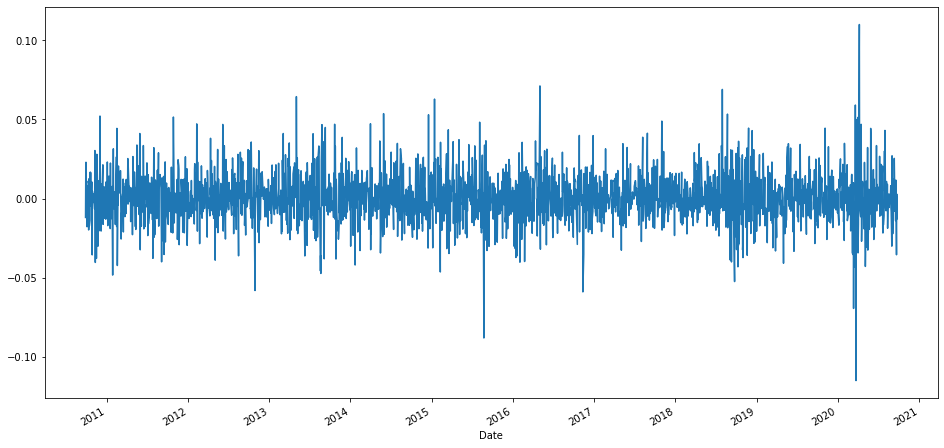

# Modern Portfolio Theory

Let us consider a portfolio  

One of the assumptions in financial modelling is that the return($R$) of a security is a random variable. The standard deviation of the return is considered to be a measure of risk. The relationship between the log return and the simple return is $r_t= log(1+R_t)$ or $R_t=e^{r_t}-1$. Log returns are more useful becuase of the additivity of risks. Lets examine this below.  
* For mutliperiod ($k$ periods) returns,  $r_t[k]=r_t + r_{t-1} + \ldots + r_{t-k+1}$.
* $Var(r_t[k]) = Var(r_t) + Var(r_{t-1}) + \ldots + Var(r_{t-k+1})$. This holds true only when $r_i$ are independent.

The expectation value of the return is $\mu = E (R)$. The standard deviation of the return($\sigma$) is considered to be a measure of risk. The return and the standard deviation have the same units.


### Some rules on random variables:
For example, consider random variables $X$,$Y$  
* $E(X+Y)= E(X)+E(Y)$
* Say $E(X)=\mu_X$, $Var(X)= E[(X_i-\mu_X)^2] = E(X^2)-\mu_X^2$
* $Var(aX)=a^2Var(X)$
* $Cov(X,Y)=E[(X-\mu_X)(Y-\mu_Y)]=E(XY)-E(X)E(Y)$
* $Var(X+Y)=Var(X)+2Cov(X,Y)+Var(Y)$
* If $X$ and $Y$ are independent, $Cov(X,Y)=0$
* Correlation = $\frac{Cov(X,Y)}{\sqrt{Var(X)Var(Y)}}$ , $-1 \le Correlation \le 1$

### Portfolio with only two securities
* Consider two securities $S_1$ and $S_2$, and their expected returns $r_1$ and $r_2$ respectively.
* The initial value of the portfolio $V(0)=$


Question: How to find optimum weights


```python
import pandas as pd
import os
import numpy as np
import matplotlib.pyplot as plt
%matplotlib inline
```


```python
# Constants
data_folder='data_2020_09_25'
variable='Adj Close'
start_date = '2010-09-25'
end_date = '2020-09-25'
n_stocks=len(os.listdir(data_folder))
```


```python
def get_stocks_data_from_folder(data_folder, variable, start_date, end_date):
    files_list=os.listdir(data_folder)
    df=pd.DataFrame()
    for filename in files_list:
        file_path=os.path.join(data_folder,filename)
        col_name=filename.replace('.NS.csv','')
        df[col_name]=read_stock_variable_from_CSV(file_path,variable,start_date, end_date)[variable]

    return df

def read_stock_variable_from_CSV(file_path,variable,start_date, end_date):
    data=pd.read_csv(file_path)
    data['Date'] = data['Date'].apply(pd.to_datetime)
    data.set_index('Date',inplace=True)
    mask = (data.index >= start_date) & (data.index <= end_date)
    return data.loc[mask][['Adj Close']]
```

 Adjusted closing is closing price but it includes stock splitting, dividends, etc.


```python
data_adj_close=get_stocks_data_from_folder(data_folder, 'Adj Close', start_date, end_date)
```


```python
missing_values_count = data_adj_close.isnull().sum()
print(missing_values_count)
data_adj_close.dropna(inplace=True)
```

    AXISBANK     8
    DABUR        8
    DRREDDY      8
    ICICIBANK    8
    INFY         8
    RELIANCE     8
    SBIN         8
    SUNPHARMA    8
    TCS          8
    dtype: int64
    


```python
data_adj_close.plot(figsize=(16,8))
```


    <matplotlib.axes._subplots.AxesSubplot at 0x1219cbdf708>


```python
daily_returns= data_adj_close.pct_change(1)
daily_returns.dropna(inplace=True)
daily_logreturns=np.log(1+daily_returns)
```


```python
daily_logreturns['AXISBANK'].plot(figsize=(16,8))
```


    <matplotlib.axes._subplots.AxesSubplot at 0x1219d46c048>





```python
daily_logreturns['DABUR'].plot(figsize=(16,8))
```


    <matplotlib.axes._subplots.AxesSubplot at 0x1219d4fcbc8>


```python
daily_logreturns.plot(figsize=(16,8))
```


    <matplotlib.axes._subplots.AxesSubplot at 0x1bc3ef49a08>


```python
fig = plt.figure(figsize = (15,10))
ax = fig.gca()
daily_logreturns.hist(ax = ax,bins=100)
```

    C:\Users\bharath\Anaconda3\lib\site-packages\ipykernel_launcher.py:3: UserWarning: To output multiple subplots, the figure containing the passed axes is being cleared
      This is separate from the ipykernel package so we can avoid doing imports until
    


    array([[<matplotlib.axes._subplots.AxesSubplot object at 0x000001BC3D1DBA88>,
            <matplotlib.axes._subplots.AxesSubplot object at 0x000001BC3D39A888>,
            <matplotlib.axes._subplots.AxesSubplot object at 0x000001BC3D3D4308>],
           [<matplotlib.axes._subplots.AxesSubplot object at 0x000001BC3D5BA0C8>,
            <matplotlib.axes._subplots.AxesSubplot object at 0x000001BC3D5EEF08>,
            <matplotlib.axes._subplots.AxesSubplot object at 0x000001BC3D623888>],
           [<matplotlib.axes._subplots.AxesSubplot object at 0x000001BC3D65E6C8>,
            <matplotlib.axes._subplots.AxesSubplot object at 0x000001BC3D695548>,
            <matplotlib.axes._subplots.AxesSubplot object at 0x000001BC3D6A0C88>]],
          dtype=object)


```python
daily_logreturns.mean()*252 # per year
```


    AXISBANK     0.059558
    DABUR        0.168364
    DRREDDY      0.133080
    ICICIBANK    0.107442
    INFY         0.184585
    RELIANCE     0.164989
    SBIN         0.014902
    SUNPHARMA    0.100159
    TCS          0.193752
    dtype: float64


```python
daily_logreturns.cov()*252 # per year
```


<div>
<style scoped>
    .dataframe tbody tr th:only-of-type {
        vertical-align: middle;
    }

    .dataframe tbody tr th {
        vertical-align: top;
    }

    .dataframe thead th {
        text-align: right;
    }
</style>
<table border="1" class="dataframe">
  <thead>
    <tr style="text-align: right;">
      <th></th>
      <th>AXISBANK</th>
      <th>DABUR</th>
      <th>DRREDDY</th>
      <th>ICICIBANK</th>
      <th>INFY</th>
      <th>RELIANCE</th>
      <th>SBIN</th>
      <th>SUNPHARMA</th>
      <th>TCS</th>
    </tr>
  </thead>
  <tbody>
    <tr>
      <th>AXISBANK</th>
      <td>0.141409</td>
      <td>0.021379</td>
      <td>0.016119</td>
      <td>0.089238</td>
      <td>0.024425</td>
      <td>0.044105</td>
      <td>0.078906</td>
      <td>0.024168</td>
      <td>0.019113</td>
    </tr>
    <tr>
      <th>DABUR</th>
      <td>0.021379</td>
      <td>0.062896</td>
      <td>0.013134</td>
      <td>0.020514</td>
      <td>0.011607</td>
      <td>0.017356</td>
      <td>0.017525</td>
      <td>0.018457</td>
      <td>0.009857</td>
    </tr>
    <tr>
      <th>DRREDDY</th>
      <td>0.016119</td>
      <td>0.013134</td>
      <td>0.073095</td>
      <td>0.017746</td>
      <td>0.012130</td>
      <td>0.017910</td>
      <td>0.015571</td>
      <td>0.029341</td>
      <td>0.009489</td>
    </tr>
    <tr>
      <th>ICICIBANK</th>
      <td>0.089238</td>
      <td>0.020514</td>
      <td>0.017746</td>
      <td>0.121848</td>
      <td>0.023538</td>
      <td>0.043791</td>
      <td>0.082593</td>
      <td>0.023135</td>
      <td>0.019609</td>
    </tr>
    <tr>
      <th>INFY</th>
      <td>0.024425</td>
      <td>0.011607</td>
      <td>0.012130</td>
      <td>0.023538</td>
      <td>0.086523</td>
      <td>0.019029</td>
      <td>0.019187</td>
      <td>0.013533</td>
      <td>0.037829</td>
    </tr>
    <tr>
      <th>RELIANCE</th>
      <td>0.044105</td>
      <td>0.017356</td>
      <td>0.017910</td>
      <td>0.043791</td>
      <td>0.019029</td>
      <td>0.083581</td>
      <td>0.041127</td>
      <td>0.022409</td>
      <td>0.019561</td>
    </tr>
    <tr>
      <th>SBIN</th>
      <td>0.078906</td>
      <td>0.017525</td>
      <td>0.015571</td>
      <td>0.082593</td>
      <td>0.019187</td>
      <td>0.041127</td>
      <td>0.133870</td>
      <td>0.019984</td>
      <td>0.014061</td>
    </tr>
    <tr>
      <th>SUNPHARMA</th>
      <td>0.024168</td>
      <td>0.018457</td>
      <td>0.029341</td>
      <td>0.023135</td>
      <td>0.013533</td>
      <td>0.022409</td>
      <td>0.019984</td>
      <td>0.094950</td>
      <td>0.012304</td>
    </tr>
    <tr>
      <th>TCS</th>
      <td>0.019113</td>
      <td>0.009857</td>
      <td>0.009489</td>
      <td>0.019609</td>
      <td>0.037829</td>
      <td>0.019561</td>
      <td>0.014061</td>
      <td>0.012304</td>
      <td>0.067860</td>
    </tr>
  </tbody>
</table>
</div>


```python
def get_portfolio_return(weights, daily_logreturns):
    return np.sum(daily_logreturns.mean()*weights)*252 # per year - 252 trading days
```


```python
def get_portfolio_variance(weights, daily_logreturns):
    return np.sqrt(np.dot(weights.T, np.dot(daily_logreturns.cov()*252,weights)))
```


```python
def generate_porfolios_stats_randomly(daily_logreturns, n_portfolios):
    n_stocks=len(daily_logreturns.columns)
    pf_returns=[]
    pf_variances=[]
    
    for i in range(n_portfolios):
        weights=np.random.random(n_stocks)
        weights /= np.sum(weights)
        pf_returns.append(get_portfolio_return(weights, daily_logreturns))
        pf_variances.append(get_portfolio_variance(weights, daily_logreturns))
    
    pf_returns=np.array(pf_returns)
    pf_variances=np.array(pf_variances)
    return pf_returns, pf_variances
```


```python
returns, variances = generate_porfolios_stats_randomly(daily_logreturns, 10000)
```


```python
def plot_portfolios(pfreturns,pfvariances):
    plt.figure(figsize = (15,8))
    plt.scatter(pfvariances, pfreturns,c=pfreturns/pfvariances, marker='o' , edgecolor='black')
    plt.grid(True)
    plt.xlabel('Expected Variance')
    plt.ylabel('Expected Return')
    plt.colorbar(label= 'Sharp Ratio')
    plt.show()
```


```python
plot_portfolios(returns,variances)
```


```python
def get_portfolio_stats(weights, daily_logreturns):
    pf_return=get_portfolio_return(weights, daily_logreturns)
    pf_variance=get_portfolio_variance(weights, daily_logreturns)
    return np.array([pf_return, pf_variance, pf_return/pf_variance])
```


```python
def get_portfolio_sharp_ration(weights, daily_logreturns):
    return -get_portfolio_stats(weights, daily_logreturns)[2]
```


```python
from scipy.optimize import minimize
def optimize_portfolio(daily_logreturns):
    n_stocks=len(daily_logreturns.columns)
    bounds = tuple((0,1) for x in range(n_stocks))
    con=({'type':'eq','fun': lambda x: np.sum(x)-1})
    weights=np.random.random(n_stocks)
    weights /= np.sum(weights)
    optimum_pf=minimize(fun=get_portfolio_sharp_ration, x0=weights, args=daily_logreturns, bounds=bounds, method='SLSQP', constraints=con)
    return optimum_pf
```


```python
opt_pf=optimize_portfolio(daily_logreturns)
print('Optimal weights:',opt_pf['x'].round(3))
```

    Optimal weights: [0.    0.299 0.152 0.    0.131 0.129 0.    0.    0.29 ]
    


```python
AXISBANK 	DABUR 	DRREDDY 	ICICIBANK 	INFY 	RELIANCE 	SBIN 	SUNPHARMA 	TCS
```


```python
# optimum portfolio statistics
opt_pf_stats=get_portfolio_stats(opt_pf['x'],daily_logreturns)
print('Expected return, Volatility and Sharp ratio:',opt_pf_stats)
```

    Expected return, Volatility and Sharp ratio: [0.17205126 0.16731228 1.02832414]
    


```python
def plot_optimum_portfolios(pfreturns,pfvariances):
    plt.figure(figsize = (15,8))
    plt.scatter(pfvariances, pfreturns,c=pfreturns/pfvariances, marker='o' , edgecolor='black')
    plt.plot(opt_pf_stats[1],opt_pf_stats[0],'g*', markersize=20)
    plt.grid(True)
    plt.xlabel('Expected Variance')
    plt.ylabel('Expected Return')
    plt.colorbar(label= 'Sharp Ratio')
    plt.show()
```


```python
plot_optimum_portfolios(returns,variances)
```


